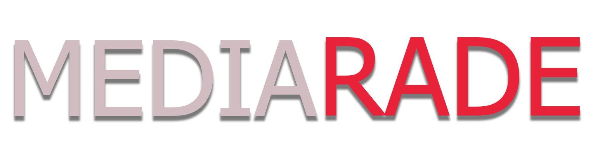

<div align="center">



# <span style="color:#f4e9ec">MediaRade</span>

**<span style="color:#ff2f46">by sgtsilicon</span>** — a YouTube and Uppbeat acquisition panel for Adobe Premiere Pro,
built around a strict, evidence-based licence risk checker.

[](#license)
[](#credits)
[](#requirements)

---
</div>

Interface is a dependency-free CSS port of [PS2UI](https://github.com/Timmy-Lane/ps2ui) (MIT) — **forked and ported by sgtsilicon to SolidJS** for MediaRade. The original PS2UI is React-based; this port runs on SolidJS, as does the rest
of MediaRade's own UI. Retinted from its blue ramp to black-and-red. No Sony assets; PlayStation and
PlayStation 2 are trademarks of Sony Interactive Entertainment.

---

## Contents

- [What it does](#what-it-does)
- [The risk checker](#the-risk-checker)
- [Preview](#preview)
- [Uppbeat](#uppbeat)
- [Requirements](#requirements)
- [Install](#install)
- [Development](#development)
- [Files it writes](#files-it-writes)
- [Credits](#credits)
- [License](#license)

---

## What it does

- **Search YouTube** with real filters (sort, length, upload date, HD/4K/subs), encoded into
  YouTube's own `sp=` protobuf so the filtering happens server-side.
- **Audit every result** against a four-level risk model before anything can be downloaded.
  Verified verdicts are cached to `Cache\license-cache.json`, so re-opening a video or re-searching
  the same results is instant — only new/expired videos hit the network. Opening a video shows a
  **Check licence** button until it has been audited; downloads stay blocked until the verdict lands.
- **Download** through `yt-dlp` as **Video + audio** (one muxed file), **Video only** or
  **Audio only**, with quality/container/format control, clip ranges, subtitles and SponsorBlock.
- **Preview in the panel** — a real stream, not a YouTube embed (see below). The stream is resolved
  the moment a video is selected, so Play starts instantly; resolved URLs are cached for the session.
- **Browse Uppbeat** and download pre-cleared library music, with the artist credit surfaced
  everywhere it matters.
- **Drag straight onto Premiere's timeline**, or one-click insert at the playhead.
- **Write the paperwork** — a `.license.json` and `attribution.txt` beside every file, a credits
  file for the project, and an append-only compliance ledger.

---

## The risk checker

The core rule: **words in a title or description are a claim, never a licence.**

The only machine-readable, platform-asserted licence signal YouTube publishes is the `license`
field in full metadata (`yt-dlp -J`) — it reads either *Creative Commons Attribution (reuse
allowed)* or *Standard YouTube Licence*. That field is the only thing treated as a licence.
Flat search listings do not contain it, so a search result is never green until it has been
verified.

| Level | Meaning |
| --- | --- |
| **CRITICAL** | Content ID already fingerprints the audio (`track`/`artist`/`album`, music metadata), or the upload is registered with a monetisation network (AdRev, Identifyy, DistroKid, TuneCore, CD Baby, Lickd…). **Never overridable.** |
| **HIGH** | The text advertises free reuse the licence field does not back up, or the work is a derivative (remix, cover, type beat, slowed+reverb) or a mislabelled reupload. Needs written permission. |
| **MODERATE** | Standard YouTube Licence, a CC NC/ND variant, or third-party material credited but not cleared. |
| **LOW** | Verified Creative Commons, no critical or warning signals. Cleared — attribution still required and written for you. |

The case this exists for: a video titled *"ROYALTY FREE — No Copyright!"* whose licence field does
not back that up. The text is marketing; the field is the licence. MediaRade reports the
contradiction as HIGH and refuses it under strict mode.

Worth knowing: for an all-rights-reserved upload YouTube returns an **empty** licence field, not
the literal string *"Standard YouTube Licence"*. An absent field is never read as permission — it
lands at MODERATE on its own, and HIGH the moment the text claims free reuse.

A genuine Creative Commons mark only covers what the uploader actually owned — credited music,
stock footage and subscription libraries (Epidemic Sound, Artlist, NCS…) keep their own licences
and are flagged separately even on a clean CC upload.

### Policy

| Setting | Passes without asking |
| --- | --- |
| **Strict mode** (default, on) | LOW only. |
| Creative Commons only | LOW only. |
| Royalty free | LOW and MODERATE. |
| Everything | Everything except CRITICAL. |

Anything the policy does not pass is *offered*, not forbidden: you get the verdict, the evidence,
and a **Download anyway** confirmation, and the choice is written to the ledger. The setting decides
what needs confirming — not what is possible. **CRITICAL is the sole exception** and never yields,
because Content ID already fingerprints the audio and no amount of consent creates a right that
is not there.

Every download, block, override and strict-mode change lands in
`Documents\MediaRade\Compliance\license-ledger.jsonl`.

> MediaRade records what the platform reported at the time of download. It is evidence of due
> diligence, not a grant of rights, and it is not legal advice.

---

## Preview

The panel does **not** embed the YouTube player. A CEP panel is served over `file://`, so its
origin is `null` and YouTube rejects the embed with *"Error 153 — Video player configuration
error"*. There is no header or parameter that fixes this.

Instead, selecting a video asks `yt-dlp` for a **progressive stream URL** (one file carrying both
picture and sound) in the background, so pressing play hands that URL straight to a plain `<video>`
and starts instantly. Resolved URLs are cached for the session, so re-opening the same video costs
nothing. If a video has no progressive stream, the panel falls back to the best remaining stream
(any codec, audio-less if that is all that exists) before giving up; if nothing resolves, it says
so and offers to open the video in your browser rather than showing a dead player.

## Uppbeat

Uppbeat publishes no documented public API. MediaRade talks to its JSON endpoints directly, using a
session taken from the browser you signed in with. Those endpoint paths live in `Setup › Uppbeat`,
so if Uppbeat changes their site you repoint them instead of waiting for a patch. Per-track
downloads only — there is deliberately no bulk catalogue harvester.

**Signing in is one button.** Press **Sign in**: MediaRade opens uppbeat.io in your browser, you
sign in there as normal, and the panel polls until the session appears and picks it up on its own.
Your password never reaches MediaRade — the browser does the authenticating, and only the
**uppbeat.io** cookies are kept (via `yt-dlp`'s cookie reader). Nothing from any other domain is
retained. If it keeps timing out, check that `Setup › Uppbeat › Sign in with this browser` matches
the browser you actually used, and close that browser — Windows locks the cookie database while it
is running.

**Signing in with email + password requires a real browser.** Uppbeat sits behind a Vercel
"security checkpoint" that answers `429` to *every* non-browser client (curl, Node, yt-dlp,
PowerShell) regardless of IP, which is why a VPN never helped. The only thing that passes it is a
real browser, so the **email & password** method opens a genuine browser window and drives it to
the login form. **Chrome is the default and the recommended browser for this path.** A Google
Chrome install is expected — if Chrome is missing, MediaRade will automatically fall back to any
other installed Chromium-family browser. Uppbeat also gates the login form behind a Cloudflare
**Turnstile** checkbox, which MediaRade solves automatically in that window (you only have to finish
a CAPTCHA if one appears). Your password goes to the login form over stdin and never appears on the
command line.

**Choose the browser used for email & password login** under `Setup › Uppbeat › Email + password
login browser` — Chrome, Edge, Brave, Opera, Vivaldi or Chromium all work, because every
Chromium-family browser speaks the same DevTools protocol. To force a specific install that lives
outside the usual install folders, set the `MR_BROWSER_PATH` environment variable to the full path
of the browser's executable. Firefox-family browsers are **not** used for this automated path (they
speak a different protocol) — use them via the one-button **Sign in** cookie-import path instead,
which reads a Firefox session natively.

**Ingest a file** remains as a fallback: if the endpoints break, download from the site yourself and
MediaRade will file the track with its credit.

**Credit.** On the free plan the artist credit is **mandatory**: every download comes with an
Uppbeat credit that must appear wherever the track is used, normally the video description. That
credit is what tells YouTube the track is licensed to you — without it the licence does not apply
and the track can still be claimed. Each track needs its own credit in every video it appears in.
MediaRade shows this on the Uppbeat tab, puts a **Copy credit** button on every track, and writes
the credit to `attribution.txt` and `CREDITS.md`. Paid plans widen catalogue access and download
limits; check your plan's scope before using a track in advertising or for a client.

---

## Requirements

- Adobe Premiere Pro 14.0 or newer (CEP 9+)
- **Google Chrome** — required for the Uppbeat **email & password** login, which drives a real
  browser window past Uppbeat's security checkpoint. If Chrome is absent, any other installed
  Chromium-family browser (Edge, Brave, Opera, Vivaldi, Chromium) is used automatically; you can
  change the selection or force a specific install in `Setup › Uppbeat`.
- [`yt-dlp`](https://github.com/yt-dlp/yt-dlp) and [`ffmpeg`](https://ffmpeg.org/) — **not
  bundled**. Put them on `PATH`, drop them in `Documents\MediaRade\bin\`, or set explicit paths in
  `Setup › Tooling`.
- Node.js 21+ (for driving the browser via the DevTools protocol) and npm, to build the panel.

---

## Install

The extension lives in `%APPDATA%\Adobe\CEP\extensions\org.rad1x.mediarade` (`%APPDATA%` is
`C:\Users\<you>\AppData\Roaming`). Two ways to get it there:

**1. Manual install** — do it by hand:

1. Clone this repo (or download it) anywhere you like.
2. Build the panel once — needs Node.js 18+ and npm:
   ```bash
   npm install
   npm run build
   ```
3. Copy the three folders `CSXS\`, `dist\` and `jsx\` into
   `%APPDATA%\Adobe\CEP\extensions\org.rad1x.mediarade\`:
   ```bash
   xcopy /e /i CSXS %APPDATA%\Adobe\CEP\extensions\org.rad1x.mediarade\CSXS
   xcopy /e /i dist %APPDATA%\Adobe\CEP\extensions\org.rad1x.mediarade\dist
   xcopy /e /i jsx  %APPDATA%\Adobe\CEP\extensions\org.rad1x.mediarade\jsx
   ```
4. Enable unsigned extensions once per CSXS version, then close and reopen Premiere — it reads the
   manifest once at startup. Open **Window › Extensions › MediaRade**.

**2. Automated `deploy`** — builds, runs the smoke tests, and copies `CSXS\`, `dist\`, `jsx\` and
`.debug` into the same extensions folder:

```bash
npm install
npm run deploy
```

The panel loads `dist/`, so **rebuild after any change under `src/`**. `window.MR.builtAt` shows
which bundle is actually running; CEF caches hard, and a stale bundle looks exactly like a broken
feature.

Unsigned extensions need debug mode enabled once per CSXS version. `install.ps1` checks this and
prints the exact command if it is missing:

```bash
reg add HKCU\Software\Adobe\CSXS.12 /v PlayerDebugMode /t REG_SZ /d 1 /f
```

To develop against the repo without re-copying, symlink instead (needs an elevated shell):

```bash
powershell -File tools\install.ps1 -Symlink
```

---

## Development

```bash
npm run build      # compile src/ -> dist/
npm run smoke      # headless checks against the built bundle
npm run verify     # build + smoke
npm run deploy     # build + smoke + install into Premiere

# verify an installed copy rather than the repo
node tools/smoke.mjs "%APPDATA%\Adobe\CEP\extensions\org.rad1x.mediarade"
```

`tools/harness.html` boots the built panel in an ordinary browser with the CEP and Node surfaces
faked, so the UI can be clicked through without Premiere.

`tools/smoke.mjs` runs the same shims under jsdom and asserts the risk verdicts, the download gate
under each policy, the `sp=` encoding, the Uppbeat credit rules and the UI wiring.

The CEF debugger is on `http://localhost:8099` while the panel is open (see `.debug`).

### Layout

```
CSXS/manifest.xml   extension manifest (MainPath -> dist/index.html)
jsx/MediaRade.jsx   ExtendScript host: import, insert, markers, bins
src/core/           licence engine, yt-dlp, uppbeat, queue, library, ledger, paths
src/ui/             shared components, drag-and-drop, placement, modal, toast
src/views/          browse, video, queue, uppbeat, library, compliance, log, settings
css/                ps2ui.css (ported tokens + components) and mediarade.css
tools/              dev harness and smoke test
```

> `js/` holds the original pre-SolidJS implementation. Nothing loads it — `dist/` is built from
> `src/`. It is kept only for reference and can be deleted.

---

## Files it writes

```
Documents\MediaRade\
  Downloads\Video, Audio, Thumbnails, Subtitles
  Downloads\Audio\Uppbeat
  Licenses\                 .license.json per download
  Compliance\               license-ledger.jsonl (append-only), CREDITS.md
  Logs\                     yt-dlp output
  bin\                      optional local yt-dlp.exe / ffmpeg.exe
  config.json, library.json
```

Respect YouTube's and Uppbeat's Terms of Service and the rights of creators.

---

## Credits

- **PS2UI** — the interface is a dependency-free CSS port of [PS2UI](https://github.com/Timmy-Lane/ps2ui) (MIT, React), **forked and ported by sgtsilicon to SolidJS** for MediaRade. The upstream design language (token contract, cube, face-button colours) belongs to Timmy-Lane; the black-and-red retint and the SolidJS/vanilla-CSS reimplementation are sgtsilicon's work. See `css/ps2ui.css` for the full attribution header.
- **yt-dlp** — media downloading is delegated to [yt-dlp](https://github.com/yt-dlp/yt-dlp), the open-source youtube-dl fork. **ffmpeg** handles muxing and transcoding.
- **SolidJS** — the panel UI is built with [SolidJS](https://www.solidjs.com/).
- **Vite** — the build tooling is [Vite](https://vitejs.dev/).

---

## License

MediaRade is released under the **Apache License, Version 2.0** — see [`LICENSE`](LICENSE). Copyright © 2026 sgtsilicon.

The interface is a CSS port of [PS2UI](https://github.com/Timmy-Lane/ps2ui) (MIT), which remains
licensed separately under its own terms. PS2UI and this project are unrelated to Sony; PlayStation
and PlayStation 2 are trademarks of Sony Interactive Entertainment.

MediaRade is provided "as is", without warranty of any kind. It records what YouTube and Uppbeat
report; it does not grant rights and is not legal advice. You are responsible for the material you
download and how you use it.
